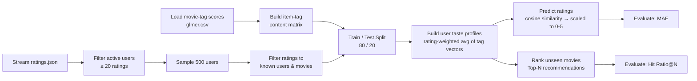

# 🎬 Content-Based Movie Recommendation System

A content-based recommender system that predicts user movie ratings and generates personalized Top-N recommendations by comparing movie tag profiles against learned user taste vectors - built and evaluated on a large-scale ratings dataset (~28M ratings, ~9,700 movies, ~1,000 tag features).

[](https://www.python.org/)
[](https://scikit-learn.org/)
[](https://pandas.pydata.org/)

---

## Overview

This project implements a **content-based filtering** recommender: rather than relying on the behavior of other users (collaborative filtering), it builds a numerical "taste profile" for each user from the movies they've rated and the descriptive tags attached to those movies, then recommends new movies whose tag profiles are most similar to that taste vector.

**Pipeline at a glance:**



## Results

| Metric | Result | What it measures |
|---|---|---|
| **Mean Absolute Error (MAE)** | **0.8826** | Average deviation between predicted and actual ratings (0.5–5 scale) |
| **Top-10 Hit Ratio** | **0.3100** (31%) | Fraction of users for whom at least one held-out liked movie appeared in their top-10 recommendations |

**Interpretation:** An MAE under 1.0 indicates predictions typically land within one rating point of the true score — a solid result for a purely content-based approach with no collaborative signal. A 31% hit ratio means roughly one in three users received a relevant recommendation in their top 10, out of thousands of candidate movies.

## Configuration used

| Parameter | Value |
|---|---|
| Minimum ratings per user | 20 |
| Sampled users | 500 |
| Test size | 20% |
| Top-N | 10 |
| Random seed | 42 |

## Project structure

```
content-based-movie-recommender/
├── src/
│   └── recommender.py      # Main pipeline: data loading, profile building, prediction, evaluation
├── requirements.txt
├── .gitignore
└── README.md
```

## How it works

1. **Content matrix** - `scores/glmer.csv` (the Tag Genome relevance scores, long format: `item_id, tag, score`) is pivoted into a wide item × tag matrix, giving each movie a numerical vector describing its content.
2. **Active user filtering** - `raw/ratings.json` is streamed (not loaded fully into memory, since it contains ~28M ratings) to identify users with at least 20 ratings, then a random sample of 500 is drawn for the experiment.
3. **Train/test split** - Ratings are split 80/20 per the standard supervised learning convention, so predictions can be validated against ratings the model never saw.
4. **User profile construction** - Each user's profile is the **rating-weighted average** of the tag vectors of movies they rated in the training set - movies they rated highly pull the profile vector toward their tag signature more strongly than movies they rated poorly.
5. **Rating prediction** - A predicted rating for a (user, movie) pair is the **cosine similarity** between the user's profile vector and the movie's tag vector, scaled from [0, 1] to a 0–5 rating range.
6. **Top-N recommendation** - For each user, all unseen movies are ranked by cosine similarity to their profile, and the top 10 are returned as recommendations.
7. **Evaluation** - MAE checks rating-prediction accuracy; Hit Ratio@10 checks whether the ranked recommendation list actually contains something the user liked in the held-out test set.

## Dataset

This project uses the **[MovieLens Tag Genome Dataset 2021](https://grouplens.org/datasets/movielens/tag-genome-2021/)**, released by [GroupLens Research](https://grouplens.org/) (University of Minnesota):

- ~10.5 million tag-movie relevance scores across **1,084 tags** applied to **9,734 movies**
- Relevance scores were generated using the **Glmer algorithm** (Vig et al., 2012) - this is what the `scores/glmer.csv` file in the dataset refers to
- Paired with the full MovieLens ratings history (`raw/ratings.json`, ~28M ratings) for this project's train/test evaluation

**Citations:**
> Vig, J., Sen, S., and Riedl, J. (2012). *The tag genome: Encoding community knowledge to support novel interaction.* ACM Trans. Interact. Intell. Syst., 2(3):13:1–13:44.

> Kotkov, D., Maslov, A., and Neovius, M. (2021). *Revisiting the tag relevance prediction problem.* In Proceedings of the 44th International ACM SIGIR Conference on Research and Development in Information Retrieval.

Download: [genome_2021.zip](https://files.grouplens.org/datasets/tag-genome-2021/genome_2021.zip) (1.8GB)

## Setup & usage

```bash
# Clone the repo
git clone https://github.com/<your-username>/content-based-movie-recommender.git
cd content-based-movie-recommender

# Install dependencies
pip install -r requirements.txt

# Run the pipeline
python src/recommender.py \
    --data_dir path/to/Movie_dataset_public_final \
    --min_ratings 20 \
    --sample_users 500 \
    --test_size 0.2 \
    --top_n 10
```

**Expected data directory structure:**
```
Movie_dataset_public_final/
├── scores/
│   └── glmer.csv        # item_id, tag, score
└── raw/
    └── ratings.json      # one JSON object per line: user_id, item_id, rating
```

> Note: the dataset itself is not included in this repository (see `.gitignore`) due to its size. Download it from the [Dataset](#dataset) section above and point `--data_dir` at your local copy.

## Tech stack

- **Python** - core implementation
- **pandas / NumPy** - data manipulation and vectorized numerical operations
- **scikit-learn** - cosine similarity, MAE, train/test splitting
- **tqdm** - progress tracking over large streamed files

## Limitations & future improvements

- **Narrow-taste bias** - content-based filtering tends to recommend items very similar to what a user has already rated, limiting discovery/serendipity compared to collaborative filtering.
- **No collaborative signal** - the model ignores patterns across users entirely, so it can't leverage "users like you also enjoyed…" signals.
- **Cold-start items** - movies with sparse or missing tag data are effectively invisible to the recommender.
- **Similarity ≠ calibrated rating** - cosine similarity is used as a proxy for predicted rating; it isn't learned or calibrated against actual rating distributions, unlike a regression or matrix-factorization approach.
- **Potential extension** - combine with collaborative filtering (hybrid recommender) or use learned embeddings (e.g., via a shallow neural network) instead of raw tag-score vectors.

## Author

**Abdullahi** - Graduate student, Artificial Intelligence Engineering, Bahçeşehir University (BAU), Istanbul.
